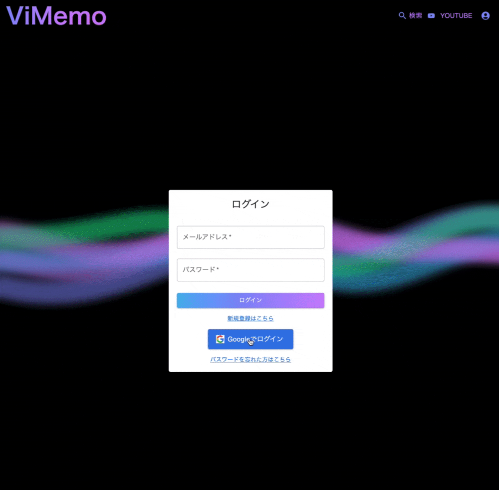

# サービス名：ViMemo

## **サービス概要**
このサービスは、動画視聴中に時間軸上で直感的にメモを追加できる機能を提供します。メモに登録されたタイムスタンプをクリックすると、その時間まで動画をスキップできます。また、いいねした動画でプレイリストを作成することができ、シャッフル再生も可能です。
画面設計は、モバイルファーストを第一優先に考えて作成しました。

## **サービスへの想い**
TV業界の照明マンは、CUEシート作成に苦労します。 
CUEシートは、次の音のタイミングで照明を調整するための進行表のようなものです。 
私も照明マンだった頃は苦労しました。 
YOUTUBEなどからアイデアを得る際、
動画に直感的にメモを書き込むことができれば、作業効率が飛躍的に向上すると考えました。 
そこで、現役の照明マンの助けになるべく、このサービスを作成することにしました。
 

## **機能紹介**
| トップ画面 | ログイン機能 |
|:-:|:-:|
|||
| MUSIC STATIONをイメージしてデザインしました。見たい説明だけ見れるように切り替えられるようにしました。 | 登録する手間を省くために、Google認証でログインできるようにしました。 |

| メモ作成 | メモ編集 |
|:-:|:-:|
|||
| 再生中でもメモを書くことが出来ます。フォームが不必要な時は閉じれるようにしています。 | モーダルを中央に表示することで、動画を視聴しながら修正しやすくしました。 |

| タイムスタンプ | プレイリスト |
|:-:|:-:|
|||
| タイムスタンプをクリックでその時間までスキップします。モバイルだと時間が表示されないので、タイムを別途表示しています（表示・非表示の切り替え可能） | いいねした動画でプレイリストを作成出来ます。シャッフル機能もつけています。 |

## **技術スタック**

| カテゴリ | 技術 | 
| --- | --- |
| フロントエンド | Next.js 14.2.3 / React 18.3.1 / TypeScript 5.4.5 | 
| バックエンド | Ruby 3.1.5 / Ruby on Rails 7.0.3 |
| データベース | fly postgres |
| 認証 | Firebase Authentication / sorcery |
| API | Youtube data API |
| 環境構築 | Docker |
| CI/CD | Github Actions |
| インフラ | Vercel / Fly.io / Amazon S3 |
| その他 | Tailwind CSS / Swiper / ESLint  CarrierWave / letter opener web |

## **構成図**

 

## **ER図**

 

## **画面遷移図**
https://www.figma.com/file/IFJvE4NJysCXdHW2bAumhK/Portfolio?type=design&node-id=0-1&mode=design&t=OX7llLQ0Tckasw5G-0
